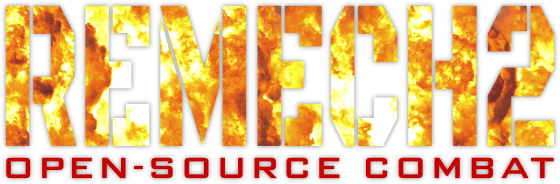
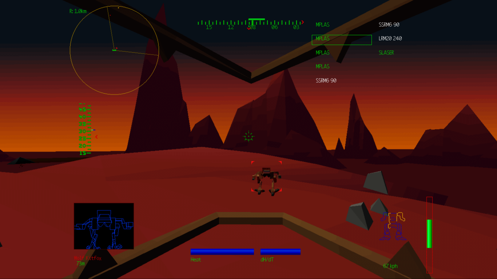

<p align="center">
  
</p>

ReMech2 is an **unofficial** open-source reimplementation of the game _MechWarrior 2: 31st Century Combat_, built for modern operating systems.

This is still a work-in-progress and things are rough and hacky, but the game currently works well enough to play on Windows 11 or Linux.

> [!IMPORTANT]
> **This project does not include the original game data at all.** You must supply your own copy of the game to run it.

<p align="center">

</p>

## Features

- A new "launcher" that runs before the sim
  - Checks the game's files
  - Can install the game from CD or folder
- Improved mouse input
- Advanced support for joysticks and other devices (HOTAS/HOSAS)
- An internal MIDI synthesizer and soundfont
- Music playback from files instead of CD audio
- Wgpu-based, aspect-correct drawing and upscaling (Vulkan/DirectX/OpenGL)
- 16:9 Hor+ widescreen support
- Unlocked framerates (up to 181 FPS, experimental)

And more...

## Bug Fixes

- Jump jet fuel now recharges regardless of framerate
- Missiles no longer explode in your face at high framerates
- Your mech's heat no longer creeps higher when the game is paused
- It is no longer impossible to explode from overheating
- The background music no longer restarts when the game is paused

There is more to come as work progresses.

## Running

Documentation is forthcoming. You'll need an installed copy of the **English** version of the original game.

If you don't currently have the game installed, run ReMech2 from within its own (writable) folder with the CD inserted or mounted.
You will be prompted to copy the necessary files from the CD or an existing installation.

### Supported Versions

Any disc with the software-rendered release, either for DOS or Windows 95:

- IBM CD-ROM
- Pentium Edition
- Windows 95/MS-DOS
- SideWinder 3D Pro

### Not Supported

- S3 ViRGE
- Matrox Mystique
- ATI 3D RAGE / RAGE II
- 3Dfx Voodoo/Diamond Monster 3D
- PowerVR
- Battlepack
- Titanium

Ghost Bear's Legacy and Mercenaries are also **not supported**.

### Music

The original game played its background music from the Red Book audio on the CD.
ReMech2 plays the game's background music from files instead.
Put the tracks in a `Music` folder in the game's working directory, named `track02.wav` through `track27.wav`, case insensitive.
The numbering matches the CD's original track numbers, which is why it starts at 2. Track 1 on the disc is always game data.

OGG, MP3, and FLAC files are also supported.

If the folder is missing or contains no files matching that pattern, the game has no music.

The folder can be changed in the `remech2.ini` that is created the first time the game is run.

```toml
[audio]
music_path="Music"
```

`music_path` can either be relative to the working directory or an absolute path.

## Building

### Requirements

- [The Rust toolchain](https://rustup.rs/)
- A C/C++ compiler
- `libclang`

#### Linux

- `clang`
- `mold` (by default)
- `libasound2-dev`
- `libudev-dev`

#### Windows

MSVC isn't currently supported.

- MinGW-w64
- `x86_64-pc-windows-gnu`
- `rustup target add x86_64-pc-windows-gnu`

### Steps

Nothing special for a Rust project. Just:

`cargo build`

Under Windows:

`cargo build --target x86_64-pc-windows-gnu`

## AI Disclaimer

The decompiled source code in `remech2-sys/original` comes from the [demech2 project](https://github.com/anpage/demech2), which used an LLM and assembly-diffing scripts to convert an annotated Ghidra project into C/C++ code that closely matches the original game's behavior.
Over time, this decompiled code will be replaced with Rust.

The majority of the Rust code is written by hand.

This README and all documentation included in this project are written by hand.

## License

ReMech2 is free software: you can redistribute it and/or modify it under the terms of the [GNU General Public License](LICENSE) as published by the Free Software Foundation, either version 3 of the License, or (at your option) any later version.

The decompiled source code in `remech2-sys/original` comes from the [demech2 project](https://github.com/anpage/demech2) and is licensed under the [GNU Lesser General Public License, version 3 or later](remech2-sys/original/LICENSE).

GeneralUser GS by S. Christian Collins is included as the default soundfont.
See [its license](assets/GeneralUser-GS-v2.0.3-license.txt) for more information.

The Squarish Sans font embedded for the overlay UI is licensed under the [SIL Open Font License, Version 1.1](assets/Squarish_Sans_CT_Regular_SC-license.txt).

The Swansea Bold font embedded for the overlay UI is public domain.

This project stands on the shoulders of giants and relies on many open-source dependencies. See [the full list](THIRD-PARTY.txt) for their licensing terms.

**ReMech2 is an unofficial, fan-made project.
It is not affiliated with, endorsed by, or associated with Microsoft, Activision, or any of their subsidiaries.
MechWarrior, Windows, and MS-DOS are trademarks of their respective owners.
No original game content is distributed with this project.**
